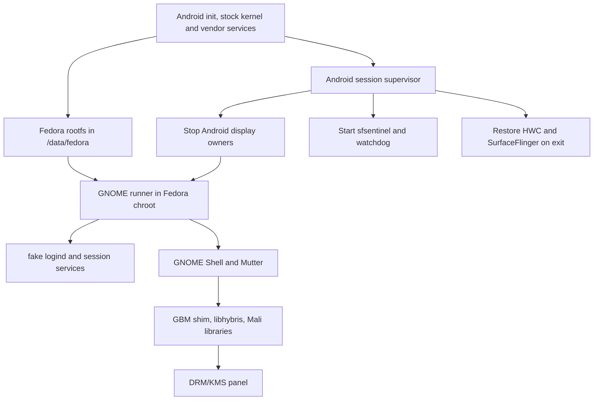

# How Fedora GNOME runs on the Tab S10 Ultra

This is a Fedora user space in a chroot on Android's stock kernel. It does not replace the tablet's boot image or boot a separate Linux kernel. The tested device is the Galaxy Tab S10 Ultra SM-X926B on firmware X926BXXS9DZG1 with the stock 6.1.145 kernel. An already-rooted Android environment starts the session.

## Session path

`src/android/fedora-enter.sh` mounts Android's `/dev`, `/proc`, `/sys`, binderfs, and a private `/run` into the Fedora rootfs. It also starts SSH and the optional volume-key switcher. The supervisor in `src/android/fedora-session-gnome-shell.sh` checks prerequisites, starts a separate watchdog, handles Android services, and launches the Fedora runner. `src/android/fedora-restore.sh` is the shared restore path. These scripts are a unit: starting GNOME without the supervisor would skip the recovery path.

The runner in `src/fedora/gnome-shell-session-runner.sh` starts a private session bus, `fake_logind.py`, GNOME services, and the compositor. There is no systemd PID 1 or real logind in the chroot. Mutter gets its session and device file descriptors through the stand-in logind. A private udev setup and `input_janitor.py` keep GNOME's input devices available without handing touch events to Android while SurfaceFlinger is stopped. `panic_chord.py` supplies the volume-key exit path.

GNOME Shell's KMS path uses `gnome_gbm_shim.so`, `liboutline-atomics-shim.so`, libhybris, and the tablet's matching Mali and Android libraries. The shim handles buffer allocation and EGL bridging for Mutter. The proprietary library closure is firmware dependent and deliberately absent from this repository. The `src/hybris` directory contains a pinned build recipe and patches for the open-source interop layer; `src/native` contains the local C sources. The desktop compositor works with GPU acceleration; desktop OpenGL and Vulkan application support remains incomplete.

`gnome-peripherals.sh` starts Fedora's Wi-Fi and sensor helpers. Android-side `android-bridge.sh` provides limited requests for Android Bluetooth and camera services, while Fedora's Python helpers expose them to GNOME. Termux runs the audio and ambient-light feeds. `integration/gnome-shell-fixes` overlays GNOME Shell 50.4 JavaScript resources, and `screen-blank@fedora-tab` blanks the screen without powering down the panel.

## Tested package baseline

These versions were read from the working Fedora rootfs on 2026-09-29. They are a compatibility baseline, not a complete package manifest.

| Package | Installed version |
| --- | --- |
| gnome-shell | 50.4-1.fc44 |
| mutter | 50.5-1.fc44 |
| python3-gobject | 3.56.3-1.fc44 |
| dbus-daemon | 1.16.2-1.fc44 |
| NetworkManager | 1.56.1-2.fc44 |
| pipewire | 1.6.8-1.fc44 |
| pulseaudio-utils | 17.0-9.fc44 |
| gstreamer1 | 1.28.7-1.fc44 |
| gnome-settings-daemon | 50.1-1.fc44 |
| xorg-x11-server-Xwayland | 24.1.13-1.fc44 |

## Boundary between source and device-specific inputs

| In this repository | Supplied by the owner of a matching device |
| --- | --- |
| Session, restore, and GNOME integration scripts | Fedora 44 aarch64 rootfs at `/data/fedora` |
| Source for native helpers and `defex_off` | Matching kernel build tree and aarch64 build toolchain |
| libhybris build recipe and patches | Device's Android, VNDK, binder, gralloc, and Mali libraries |
| GNOME overlays and extension | Compatible GNOME Shell 50.4 runtime |
| Termux audio and sensor scripts | Termux, Termux:API, and required audio modules |

For source placement, build outputs, preflight, and session commands, read [deployment notes](DEPLOYMENT.md). For app graphics experiments and their limits, read [graphics experiments](../experiments/graphics/README.md).

## Invariants learned on the working device

- Stop and restore Android's display services only through the supervised session. The restore helper checks that DRM master is free before starting HWC and SurfaceFlinger.
- Keep the watchdog, `sfsentinel`, and the time limit intact. They protect the Android framework and bring the screen back after GNOME exits.
- Keep Android input isolated while SurfaceFlinger is stopped. A stray touch event can cause Android's framework to restart.
- Never power the panel down inside a session; the GNOME screen-blank extension provides a black screen instead.
- Nothing may create an Android window while SurfaceFlinger is stopped. The window cannot be drawn and the framework dies. Known sources and how each is handled:
  - A keyboard-layout toast appears when the pogo keyboard clone is created. The supervisor waits for toasts to clear before stopping SurfaceFlinger.
  - Re-attaching the keyboard creates new input nodes. They are hidden from `system_server`.
  - Touch and rotation are handled by input isolation and by turning auto-rotate off for the session.
  - A repeated app crash shows an "app has stopped" dialog. Plugging in USB-C mid-session used to end the session this way: Samsung's MTP service crashed twice while trying to show a toast, and the dialog killed `system_server`. The session now sets the `hide_error_dialogs` global setting and restores it afterwards (`src/android/fedora-android-settings.sh`). Unplugging USB-C mid-session has not been tested.
- Build the kernel module and vendor library set for the exact device and firmware. A mismatched build is outside the tested configuration.
